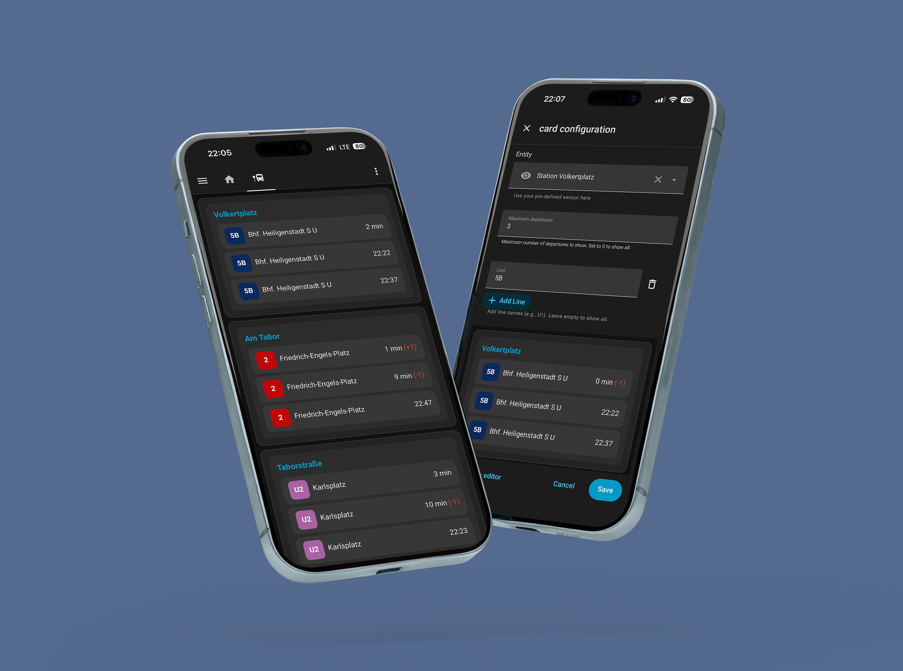

# Vienna Public Transport Card

[](https://github.com/pslowak/vienna-transport-ha/actions/workflows/be-test.yml)

A custom integration and Lovelace card for [Home Assistant](https://www.home-assistant.io/) that displays real-time public transport departures in Vienna, Austria (Wiener Linien).



## Installation

1. Copy `custom_components/vienna_transport_ha/` into your Home Assistant `custom_components/` directory.
2. Restart Home Assistant.
3. Copy `dist/transport-card.js` into your Home Assistant `www/` directory.
4. Register the card resource in your Home Assistant configuration (see [Registering Resources](https://developers.home-assistant.io/docs/frontend/custom-ui/registering-resources/)).

## Configuration

1. Go to **Settings → Devices & Services → Add Integration**.
2. Search for *Vienna Public Transport* and select it.
3. Enter the **RBL stop IDs** you want to monitor. 
4. A sensor entity (e.g. `sensor.vienna_transport_departures_for_stop_2683`) is created for each stop ID.

## Lovelace Card

Add the card to your dashboard:

```yaml
type: 'custom:transport-card'
entity: sensor.vienna_transport_departures_for_stop_2683
max_departures: 3
```

### Options

| Option           | Type   | Required | Default | Description                                    |
|:-----------------|:-------|:---------|:--------|:-----------------------------------------------|
| `type`           | string | required | -       | Must be `custom:transport-card`                |
| `entity`         | string | required | -       | Sensor entity ID                               |
| `lines`          | array  | optional | all     | List of lines to show                          |
| `max_departures` | number | optional | all     | Maximum number of departures to show           |

## Development

### Backend (Python)

```bash
uv sync --extra dev                   # Install dependencies
uv run pytest                         # Run tests
uv run ruff check                     # Linting
uv run mypy custom_components tests   # Type checking
```

### Frontend (Lovelace card)

```bash
npm install                 # Install dependencies
npm run dev                 # Development server
npm run build               # Build the card
npm run test                # Run tests
```
