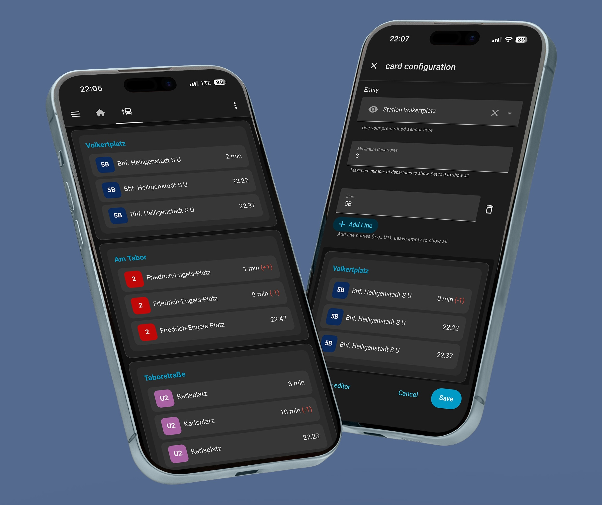

<h1 align="center">Vienna Public Transport</h1>

<p align="center"><em>Real-time departures for Vienna's public transport, right on your Home Assistant dashboard.</em></p>

[](https://github.com/pslowak/vienna-transport-ha/releases/latest)
[](https://github.com/hacs/integration)
[](https://github.com/pslowak/vienna-transport-ha/actions/workflows/be-test.yml)

A custom integration and Lovelace card for [Home Assistant](https://www.home-assistant.io/) that displays real-time public transport departures in Vienna, Austria (Wiener Linien).



## Features

- **Live departures** from Wiener Linien
- **Delay indicator** - know exactly which departure is running late and by how much
- **Cooling indicator** - know exactly which vehicles are air-conditioned
- **Auto-registered Lovelace card** - no manual resource setup
- **One sensor per stop** - multiple stops per config entry

## Installation

### HACS (recommended)

1. In HACS go to **Settings → Custom repositories** and add `https://github.com/pslowak/vienna-transport-ha` (category: **Integration**).
2. Search for *Vienna Public Transport*, and download it.
3. Restart Home Assistant.

### Manual

1. Download the latest release from the [GitHub releases page](https://github.com/pslowak/vienna-transport-ha/releases). 
2. Copy `custom_components/vienna_transport/` into your `custom_components/` directory.
3. Restart Home Assistant.

## Configuration

1. Go to **Settings → Devices & Services → Add Integration**.
2. Search for *Vienna Public Transport* and select it.
3. Enter the **RBL stop IDs** you want to monitor. You can find stop IDs via the [RBL search](https://till.mabe.at/rbl/).
4. A sensor entity (e.g. `sensor.vienna_transport_departures_for_stop_2683`) is created for each stop ID.
5. If the card does not appear in the Lovelace card picker, **clear your browser cache**.

## Lovelace Card

Add the card to your dashboard:

```yaml
type: 'custom:transport-card'
entity: sensor.vienna_transport_departures_for_stop_2683
max_departures: 3
```

### Options

| Option           | Type   | Required | Default | Description                                    |
|:-----------------|:-------|:---------|:--------|:-----------------------------------------------|
| `type`           | string | required | -       | Must be `custom:transport-card`                |
| `entity`         | string | required | -       | Sensor entity ID                               |
| `lines`          | array  | optional | all     | List of lines to show                          |
| `max_departures` | number | optional | all     | Maximum number of departures to show           |

## Development

### Backend (Python)

```bash
uv sync --extra dev                   # Install dependencies
uv run pytest                         # Run tests
uv run ruff check                     # Linting
uv run mypy custom_components tests   # Type checking
```

### Frontend (Lovelace card)

```bash
npm install                   # Install dependencies
npm run dev                   # Development server
npm run build                 # Build the card
npm run build:release         # Build the card for release
npm run test                  # Run tests
```
