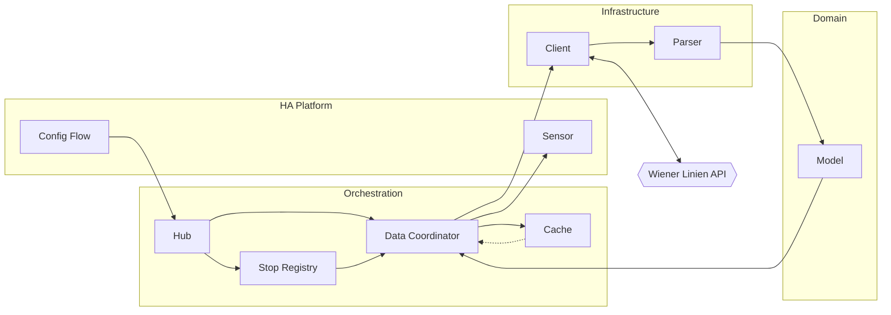

# Architecture

This document describes how the backend of the Vienna Transport integration is
structured and what each component is responsible for.

## Overview

The integration adds real-time departures for Vienna's public transport to Home
Assistant. Users create one or more config entries through the Config Flow,
each with a set of stop IDs, and get one Sensor per stop ID.

Architecture is split into four layers plus an external service, as shown in
the diagram below:

* **HA Platform** — Config Flow, Integration Setup and Sensor interface with
  Home Assistant. Manages config entry lifecycle and entity creation.
* **Orchestration** — Hub, Stop Registry, Data Coordinator and Cache coordinate
  polling and state. The Hub is the integration singleton: the first entry
  builds it, later entries register with it, removal tears it down when empty.
  The Registry tracks the union of stop IDs per entry.
* **Infrastructure** — Client and Parser handle I/O. The Client talks to the
  external Wiener Linien API, the Parser converts the raw response into typed
  data.
* **Domain** — Data model. 

## Components

| Layer          | Name                         | File             | Responsibility                                                                                                                      |
|----------------|------------------------------|------------------|-------------------------------------------------------------------------------------------------------------------------------------|
| HA Platform    | `ViennaTransportConfigFlow`  | `config_flow.py` | Setup wizard: validates stop IDs, rejects duplicates across entries, probes API connectivity.                                       |
| HA Platform    | `async_setup_entry`          | `__init__.py`    | Lifecycle glue: builds Hub on first entry, delegates register/unregister to Hub, forwards platform setups, registers frontend once. |
| HA Platform    | `ViennaTransportSensor`      | `sensor.py`      | One entity per stop ID. Reads `Model` from coordinator's `TransportData`.                                                           |
| HA Platform    | `async_register_card`        | `frontend.py`    | Serves Lovelace card and registers it as a module resource.                                                                         |
| Orchestration  | `ViennaTransportHub`         | `hub.py`         | Integration singleton. Holds Registry and Coordinator, maps entry lifecycle to registry updates and coordinator refresh/shutdown.   |
| Orchestration  | `StopRegistry`               | `registry.py`    | Tracks which stop IDs belong to which config entry. Exposes the union of all stops.                                                 |
| Orchestration  | `ViennaTransportCoordinator` | `coordinator.py` | Polls the registered stops every 60s and dispatches `TransportData` to sensors. Falls back to Cache on client or parser errors.     |
| Orchestration  | `ExpiringCache`              | `cache.py`       | TTL cache of last good `TransportData` for resilience during API outages.                                                           |
| Infrastructure | `ViennaTransportClient`      | `client.py`      | Fetches raw departure data from the Wiener Linien API for all registered stops.                                                     |
| Infrastructure | `ViennaTransportParser`      | `parser.py`      | Converts raw API response into typed `Model` data.                                                                                  |
| External       | `Wiener Linien API`          | —                | External HTTPS service.                                                                                                             |
| Domain         | `Model`                      | `model.py`       | Domain Model.                                                                                                                       |
